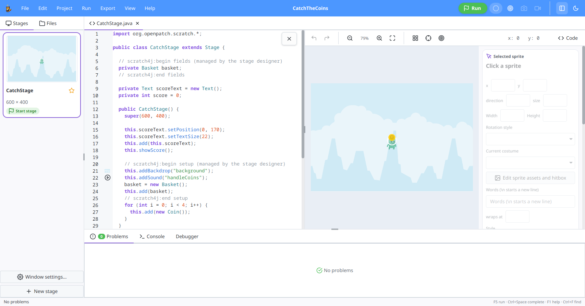

# Scratch for Java Studio

Scratch for Java Studio is a desktop IDE for students moving from Scratch to
Java. It builds projects with [Scratch for Java](https://github.com/openpatch/scratch-for-java)
and keeps them as ordinary Java source files that also work in BlueJ and VS Code.

**Status: 0.1.0-alpha.8.** The IDE and its
project format may change while we test it with students and teachers.



## Features

- Create a project from a starter, tutorial, or demo; open an existing project
  folder or import a Scratch `.sb3` project.
- Edit Java with completion, live diagnostics, beginner-friendly explanations
  in English and German, a Scratch block palette, and API help.
- Arrange stages and sprites in visual editors. Managed Java regions keep the
  visual editors and source code in sync while leaving other code editable.
- Edit images, sounds, sprite sheets, hitboxes, shaders, and Tiled maps.
- Run programs in a separate JVM, use the console and debugger, and export a
  runnable JAR, a portable app folder, or a BlueJ/VS Code project ZIP.

Student programs use the Scratch for Java library. The IDE does not replace or
modify that library.

## Build and run from source

Install JDK 25 and Maven 3.9 or newer. A graphical desktop is needed to run
the IDE and student programs.

```bash
mvn verify
mvn -pl app -am install -DskipTests
mvn -pl app exec:java
```

Run `exec:java` with `-pl app` only: the parent project has no main class.
After changing source code, repeat the `install` command and restart the IDE
so `exec:java` uses the updated modules in your local Maven repository.

## Package the alpha

Run the packaging script on the target operating system. It includes a
JetBrains Runtime for the IDE and student programs, so users do not need to
install a JDK. The same runtime supports enhanced hot reload.

```bash
scripts/package-ide.sh app-image  # portable application folder
scripts/package-ide.sh deb        # Linux package
scripts/package-ide.sh msi        # Windows installer, on Windows
scripts/package-ide.sh dmg        # macOS disk image, on macOS
```

Outputs are written to `target/package/`. The GitHub Actions
[`Package IDE`](.github/workflows/package.yml) workflow builds platform
artifacts when run manually or when an alpha tag is pushed. Packaging may
download the Scratch for Java library and a JetBrains Runtime. Signing and
notarization require the corresponding CI secrets.

The six Maven modules are `core` (projects and editing logic), `runner`
(separate JVM execution), `sound`, `export`, `ui` (JavaFX), and `app`
(entry point and packaging).

## License

The IDE is [MIT licensed](LICENSE). Bundled Scratch for Java artwork and sounds
come from [Kenney](https://kenney.nl) under CC0. OGG and MP3 support uses
replaceable LGPL libraries; RichTextFX, AtlantaFX, Ikonli, and Feather icons
retain their respective licenses.


## Continue between browser and desktop

Open a browser workspace JSON or portable project ZIP through the Project menu.
Export a Browser project ZIP to continue in an embedded IDE revision with ZIP
support. Code, assets, flavor and lesson identity travel with the project. NRW
course classes remain ordinary source on desktop and are retained in the browser.

Use Project > Import course pack for the offline tutorial/Spielwerkstatt pack.
Run > Run behavior checks executes transferred browser test classes with bundled
JUnit, leaving their source unchanged. Scratch imports have a Scratch migration
tab linking timing/unsupported-block tasks to the original block and Java source;
the original .sb3 remains in the project.

Run all checks locally with `scripts/test.sh`, or pick stages:

```sh
scripts/test.sh unit          # mvn verify (CI runs this on Linux, Windows and macOS)
scripts/test.sh smoke         # OpenGL, UI and export smoke (CI runs this on Linux)
scripts/test.sh integration   # release catalogs, course pack, browser transfer
```

Integration is local only: it uses sibling checkouts of `scratch-for-java` (at
the bundled release tag, via a temporary worktree), `hyperbook-informatik` and
`online-ide`; set `SCRATCH_LIBRARY`, `CURRICULUM` or `ONLINE_IDE` to use other
paths. Run it before a release or after changing templates, export or import.
The course check imports and compiles all 18 projects and runs the score tests.
Use `--libraries /path/to/bundled/library` for a fully offline check. The native
packaging workflow runs `scripts/smoke-packaged.py` on each supported OS. Local
Linux validation uses Xvfb when no display is available.
